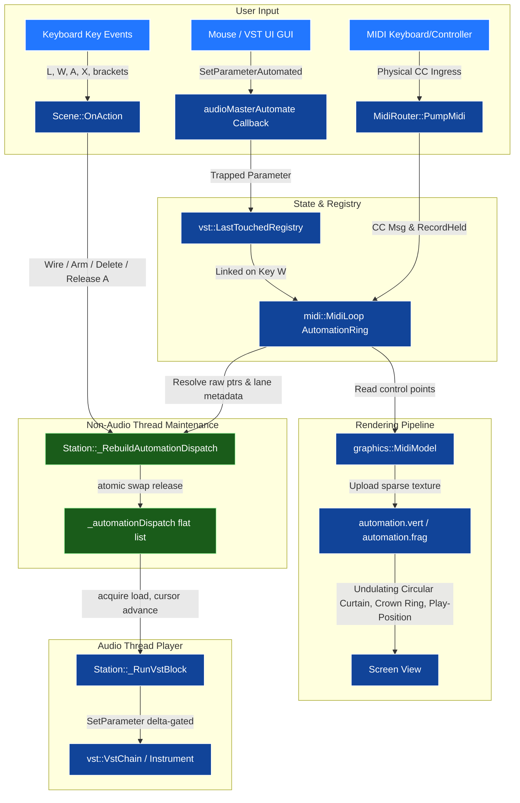

# MIDI Automation Recording, 3D Display, and VST Instrument Playback Plan

This plan outlines the design and implementation details for adding low-latency MIDI automation recording and playback to JammaLib, accompanied by a dynamic, undulating 3D ring visualizer.

Coding rule for this plan: constants and helper functions must be attached to the owning class or namespace, not dropped into anonymous namespaces. Prefer named class members, static class helpers, or constexpr class-scoped values over file-local anonymous helpers.

---

## Agentic Workflow

This plan is designed to be executed in **two agent sessions** with a clean engine/rendering split.

### Session 1 — Engine Backend (Phases 1–4)

**Covers:** VST interface, MidiLoop data model, MIDI learn + keyboard arming, audio-thread dispatch.

**Implement strictly in order:**
1. **Phase 1** — VST interface + registry. Build clean before moving on.
2. **Phase 2** — `MidiLoop` automation data model. Data structures and interpolation only; no rendering.
3. **Phase 3** — Keyboard arming, MIDI learn hooks, `Scene::OnAction` bindings.
4. **Phase 4** — Flat dispatch list, `_RebuildAutomationDispatch`, `_RunVstBlock` loop.

**Stop when:**
- `JammaLib` and `Jamma` build clean with no warnings introduced.
- A CC knob move during `A`-held recording writes control points into `MidiLoop::_lanes`.
- `_RebuildAutomationDispatch` populates the flat list and `_RunVstBlock` calls `SetParameter` for at least one active lane (verified by a GTest or a scoped debug trace — no rendering required).

**Handover:** Prepend `[DONE]` to each completed section heading (e.g. `### [DONE] 1-A: ...`). If the session ends mid-phase, mark the incomplete section `[IN PROGRESS]` and add a `> **Agent note:**` blockquote immediately below it describing exactly what was finished, what file/line to resume from, and any invariants that must hold before continuing. Leave Phases 5–6 headings untouched.

---

### Session 2 — Multi-Lane + Rendering (Phases 5–6)

**Prerequisite:** Session 1 complete. Flat dispatch list is live; `SetParameter` is being called correctly.

**Implement in order:**
1. **Phase 5** — Confirm `MaxAutomationLanes` wiring through the dispatch rebuild; add any missing `SelectedLaneIndex` / multi-lane recording paths.
2. **Phase 6** — `automation.vert` / `automation.frag` shaders, `MidiModel` VAO/VBO setup, live control-point texture uploads.

**Stop when:**
- Both shaders compile and link.
- `MidiModel::Draw3d` renders the curtain, crown ring, and play-position indicator.
- Live recording visibly undulates the curtain in real time.

**Handover:** Mark all completed sections `[DONE]`. Apply the same `[IN PROGRESS]` + blockquote convention for any work left mid-section.

---

## Architecture Overview



---

## Phase 1: Track Last Touched Parameter

### 1-A: Interface Extension `IVstPlugin`
- Modify `IVstPlugin` in [JammaLib/src/vst/IVstPlugin.h](JammaLib/src/vst/IVstPlugin.h) to expose parameter setters:
  ```cpp
  virtual void SetParameter(unsigned int index, float value) noexcept = 0;
  virtual float GetParameter(unsigned int index) const noexcept = 0;
  ```

### 1-B: VST2 Plugin Implementation
- Implement the methods in [JammaLib/src/vst/Vst2Plugin.h](JammaLib/src/vst/Vst2Plugin.h) and [JammaLib/src/vst/Vst2Plugin.cpp](JammaLib/src/vst/Vst2Plugin.cpp):
  ```cpp
  void Vst2Plugin::SetParameter(unsigned int index, float value) noexcept {
      if (_effect) {
          _effect->setParameter(_effect, index, value);
      }
  }
  float Vst2Plugin::GetParameter(unsigned int index) const noexcept {
      return _effect ? _effect->getParameter(_effect, index) : 0.0f;
  }
  ```
- Implement empty stubs in [JammaLib/src/vst/Vst3Plugin.cpp](JammaLib/src/vst/Vst3Plugin.cpp) to satisfy the compiler interface checks.

### 1-C: Last Touched Registry
- Add a thread-safe registry in `vst` namespace inside [JammaLib/src/vst/IVstPlugin.h](JammaLib/src/vst/IVstPlugin.h):
  ```cpp
  struct LastTouchedParameter {
      std::atomic<IVstPlugin*> Plugin{nullptr};
      std::atomic<unsigned int> ParameterIndex{0u};
      std::atomic<float> Value{0.0f};
  };
  extern LastTouchedParameter g_lastTouchedParam;
  ```
- Update `HostCallback` in [JammaLib/src/vst/Vst2Plugin.cpp](JammaLib/src/vst/Vst2Plugin.cpp)'s `audioMasterAutomate` case:
  ```cpp
  case audioMasterAutomate:
      if (self) {
          g_lastTouchedParam.Plugin.store(self, std::memory_order_relaxed);
          g_lastTouchedParam.ParameterIndex.store(index, std::memory_order_relaxed);
          g_lastTouchedParam.Value.store(opt, std::memory_order_relaxed);
      }
      return 0;
  ```

---

## Phase 2: In-Memory Automation Timeline inside `MidiLoop`

### 2-A: Automation Timeline Representation
- Represent the automation as sparse control points in the loop timeline and upload them to the GPU as an $N \times 2$ lookup texture, where each texel stores:
  - `R`/`x`: the automation value
  - `G`/`y`: the fractional position through the loop where that value applies
- Each `MidiLoop` holds a fixed-size array of **automation lanes** (`MaxAutomationLanes = 8`). Each lane is self-contained: it owns its `AutomationMapping` metadata, its sparse control-point buffer, and its point count. This directly supports Phase 5 (multiple wirings, simultaneous recording) without any structural change later.
- In [JammaLib/src/midi/MidiLoop.h](JammaLib/src/midi/MidiLoop.h), establish:
  ```cpp
  struct AutomationMapping {
      // Active, Channel, and CC must be read atomically together on the MIDI thread
      // (CC matching) while written together on the UI thread (key W). Pack all three
      // into one uint32_t so a reader always sees a consistent triple.
      // Encoding: bit 16 = Active, bits [15:8] = Channel, bits [7:0] = CC; 0 = inactive.
      std::atomic<std::uint32_t> MatchKey{0u};

      // Written and read on the non-audio thread only (_RebuildAutomationDispatch).
      // No atomic needed.
      vst::IVstPlugin* TargetPlugin{nullptr};
      unsigned int     TargetParameterIndex{0u};

      static constexpr std::uint32_t kInactive = 0u;
      static constexpr std::uint32_t MakeMatchKey(std::uint8_t ch, std::uint8_t cc) noexcept {
          return (1u << 16) | (static_cast<std::uint32_t>(ch) << 8) | static_cast<std::uint32_t>(cc);
      }
      bool         IsActive()   const noexcept { return (MatchKey.load(std::memory_order_relaxed) >> 16) & 1u; }
      std::uint8_t GetChannel() const noexcept { return static_cast<std::uint8_t>(MatchKey.load(std::memory_order_relaxed) >> 8); }
      std::uint8_t GetCC()      const noexcept { return static_cast<std::uint8_t>(MatchKey.load(std::memory_order_relaxed)); }
  };

  struct AutomationLane {
      AutomationMapping Mapping;
      std::array<std::pair<float, float>, 256u> Points{}; // (frac, value)
      std::size_t PointCount = 0u;
  };

  class MidiLoop {
  public:
      static constexpr std::size_t MaxAutomationLanes = 8u;

      // Write a value at the given fractional position into lane laneIdx.
      void SetAutomationValueAtFrac(std::size_t laneIdx, double frac, float value) noexcept;
      // Cursor-advancing read on lane laneIdx: advances cursorIdx forward to the correct
      // bracket, returns the linearly interpolated value. Resets cursor on loop wrap
      // (detected when frac < points[cursor].frac). Amortised O(1) per block.
      float GetAutomationValueAtCursor(std::size_t laneIdx, double frac, std::uint16_t& cursorIdx) const noexcept;

      AutomationLane& GetLane(std::size_t idx) noexcept { return _lanes[idx]; }
      const AutomationLane& GetLane(std::size_t idx) const noexcept { return _lanes[idx]; }

  private:
      std::array<AutomationLane, MaxAutomationLanes> _lanes{};
  };
  ```
- The CPU keeps each lane's sparse points in their native form; the GPU receives a lane's points as a compact 2-channel texture for display. Each lane uploads independently.

### 2-B: Read/Write Interpolation Implementation
- Inside [JammaLib/src/midi/MidiLoop.cpp](JammaLib/src/midi/MidiLoop.cpp):
  - Preserve sparse points exactly as they are recorded.
  - When a new point arrives, insert or update the point in the loop-local control-point storage.
  - For audio playback, continue to evaluate the curve via linear interpolation between neighboring control points.
  - For display, upload the control-point texture to the GPU and let the shader perform piecewise-linear lookup against the sparse timeline data.

---

## Phase 3: Keyboard Arming and MIDI Learn Hooks

### 3-A: Interactive State Flags
- Add flags inside [JammaLib/src/midi/MidiRouter.h](JammaLib/src/midi/MidiRouter.h):
  ```cpp
  namespace midi {
      extern std::atomic<bool>          LearnMidiCCMode;
      extern std::atomic<std::uint8_t>  LearnedCC;            // 0xffu = nothing captured yet
      extern std::atomic<std::uint8_t>  LearnedChannel;       // 0xffu = nothing captured yet
      extern std::atomic<bool>          AutomationRecordHeld;
      extern std::atomic<std::uint8_t>  SelectedLaneIndex;    // which lane slot W/A targets (0..MaxAutomationLanes-1)
      extern std::atomic<MidiLoop*>     RecordTargetLoop;     // loop being recorded; nullptr = all lanes play back
  }
  ```
- `LearnedCC` and `LearnedChannel` are **written inside `MidiRouter::PumpMidi`** whenever a CC message arrives and `LearnMidiCCMode` is `true`. This is the CC capture step: the user moves a physical knob/slider and the system automatically captures the controller number and channel without any further key press.
- `RecordTargetLoop` is a **raw observer pointer** — its lifetime is externally guaranteed by the `LoopTake` that owns it. It must be cleared to `nullptr` before any `MidiLoop` is destroyed (handled in `LoopTake` teardown).

### 3-B: Interactive Key Bindings
- Modify `Scene::OnAction(KeyAction)` in [JammaLib/src/engine/Scene.cpp](JammaLib/src/engine/Scene.cpp#L446):
  - Key `L` — **Learn Mode** (on key-down): Toggle `LearnMidiCCMode`. When toggling **off**, also reset `LearnedCC` and `LearnedChannel` to `0xffu` so a stale capture cannot be accidentally wired on a future press.
  - Key `W` — **Wire Command** (on key-down):
    - Requires `LearnedCC != 0xffu` (a CC was captured) **and** `LastTouchedParam.Plugin != nullptr` (a VST parameter was touched).
    - Query the hovered `MidiLoop` via the current selector. If none, do nothing.
    - Write to `loop.GetLane(SelectedLaneIndex)`: set `Active = true`, `Channel`, `ControllerNumber`, `TargetPlugin`, `TargetParameterIndex` from the captured state.
    - **This writes to the selected lane slot** — it does not append a new one blindly. If slot `SelectedLaneIndex` already had a wiring, it is replaced. To add a second wiring, the user first cycles to the next empty slot with `]` (see below).
    - After wiring: exit learn mode (`LearnMidiCCMode = false`, clear `LearnedCC`/`LearnedChannel`), and call `Station::_RebuildAutomationDispatch()` on the non-audio thread.
  - Key `X` — **Delete Lane** (on key-down): Clear `loop.GetLane(SelectedLaneIndex)` on the hovered loop — set `Active = false`, reset all fields, erase control points. Trigger `_RebuildAutomationDispatch`.
  - Key `[` / `]` — **Cycle Selected Lane** (on key-down): Decrement / increment `SelectedLaneIndex` (wrapping within `0..MaxAutomationLanes-1`). The renderer should highlight the active lane so the user knows which slot they're operating on.
  Key `A` — **Automation Record Mode**: Set `AutomationRecordHeld = true` and `RecordTargetLoop = hoveredLoop` **on key-down**; clear both back to `false` / `nullptr` **on key-up**, then immediately call `Station::_RebuildAutomationDispatch()`. The rebuild's `release` store on `_automationDispatch` establishes a happens-before between all MIDI thread writes to `Points` during recording and the audio thread's subsequent `acquire` load of the dispatch pointer. Without this fence, the audio thread could read stale control-point data on the first playback block. The held-key model means recording is always intentional and transient — releasing `A` triggers the fence and immediately resumes playback on that loop's lanes.

---

## Phase 4: Audio Thread Playback Routing

### 4-A: Pre-baked Flat Dispatch List (eliminates nested weak_ptr::lock chains)

The naïve approach of walking `state.LoopTakes → weak_ptr::lock → GetMidiLoops → GetAutomation` inside `_RunVstBlock` pays O(takes × midiLoops) in atomic refcount increments, shared_ptr pointer chasing, and per-entry atomic loads — every audio block, at audio-thread priority. This is unacceptable.

Instead, build a compact flat list on the **non-audio thread** whenever automation wiring changes, and publish it with the same double-buffer atomic-swap pattern already used for `_audioState`.

Add to [JammaLib/src/engine/Station.h](JammaLib/src/engine/Station.h):
```cpp
struct AutomationDispatch {
    vst::IVstPlugin* plugin;          // raw observer — lifetime owned by VstChain
    unsigned int     paramIdx;
    midi::MidiLoop*  loop;            // raw observer — lifetime owned by LoopTake
    std::uint8_t     laneIdx;         // which lane within loop to read/write
    std::uint32_t    loopLengthSamps; // pre-resolved; avoids per-block takes lock
    std::uint16_t    cursorIdx = 0u;  // playback cursor for O(1) amortised interpolation
    float            lastValue = -2.f; // sentinel: force first write
};
static constexpr std::size_t MaxAutomationDispatches = 64u;

std::atomic<AutomationDispatch*> _automationDispatch{nullptr};
AutomationDispatch _automationDispatchBuf[2][MaxAutomationDispatches]{};
std::uint8_t       _automationDispatchCount[2]{};
std::uint8_t       _automationDispatchBack = 0u;
```

Add `_RebuildAutomationDispatch()` — called on the non-audio thread whenever automation is wired or the loop set changes. It walks all takes and MIDI loops, resolves all raw pointers, and atomically publishes the new front buffer. This is the only place that traverses weak_ptrs and shared_ptrs for automation purposes.

### 4-B: Per-loop `frac` from `blockStartSample` (not from the clock)

`_clock->FractionalPosition()` would use `SeedSourceLength()` as the denominator — correct only for the seed loop. Overdub loops may be harmonically related but still have independent lengths. Each dispatch entry stores `loopLengthSamps` pre-resolved at build time. Per-block fractional position:

```cpp
const double frac = (entry.loopLengthSamps > 0u)
    ? std::fmod(static_cast<double>(blockStartSample), static_cast<double>(entry.loopLengthSamps))
      / static_cast<double>(entry.loopLengthSamps)
    : 0.0;
```

This is correct for all loop configurations and costs one `fmod` instead of an indirect clock method call.

### 4-C: Playback cursor — O(1) amortised interpolation (replaces O(N) scan)

`GetAutomationValueAtFrac` with up to 256 sparse control points costs up to 256 comparisons per active mapping per block if searching from index 0. Since playback is monotonically forward (wrapping only at loop boundaries), the bracket for the current `frac` advances by at most 1–2 control points per block in normal use.

Store `cursorIdx` in each `AutomationDispatch`. Per block:
1. Advance cursor forward while `points[cursor+1].frac <= frac` (typically 0–2 iterations).
2. Interpolate linearly between `points[cursor]` and `points[cursor+1]`.
3. On loop wrap (detected when `frac < lastFrac`), reset cursor to 0.

Amortised cost across a full loop playback: O(total control points) — equivalent to a single pass, not one pass per block.

### 4-D: Delta-threshold gate — suppress redundant `SetParameter` calls

VST2 `setParameter` is an opcode dispatch that can trigger coefficient recalculation inside the plugin on every call. On a flat or slow-moving automation curve (the common case), the value barely changes between consecutive blocks. Gate the call:

```cpp
constexpr float automationEpsilon = 1.0f / 65536.0f; // below 16-bit parameter resolution
if (std::abs(val - entry.lastValue) > automationEpsilon) {
    entry.plugin->SetParameter(entry.paramIdx, val);
    entry.lastValue = val;
}
```

On a steady-state loop after the first pass, this reduces `SetParameter` calls to zero — the dominant cost on a playing-but-not-moving automation lane.

### 4-E: Final audio-thread dispatch loop in `_RunVstBlock`

With the above in place, the audio-thread path collapses to:

```cpp
// acquire pairs with the release store in _RebuildAutomationDispatch,
// ensuring all MIDI-thread writes to Points are visible once recordHeld goes false.
const bool        recordHeld   = midi::AutomationRecordHeld.load(std::memory_order_acquire);
const MidiLoop*   recordTarget = midi::RecordTargetLoop.load(std::memory_order_relaxed);
const auto*       dispatches   = _automationDispatch.load(std::memory_order_acquire);
// Derive front buffer index from which half of _automationDispatchBuf the pointer falls in.
const std::uint8_t frontIdx   = dispatches ? (dispatches == _automationDispatchBuf[0] ? 0u : 1u) : 0u;
const auto         count      = dispatches ? _automationDispatchCount[frontIdx] : 0u;

for (auto i = 0u; i < count; ++i)
{
    auto& entry = dispatches[i];
    // Suppress playback only for lanes on the loop that is actively being recorded.
    // Other loops' lanes (different MidiLoop*) continue playing back unaffected.
    if (recordHeld && entry.loop == recordTarget) continue;

    // Per-loop fractional position from block-start sample.
    const double frac = (entry.loopLengthSamps > 0u)
        ? std::fmod(static_cast<double>(blockStartSample),
                    static_cast<double>(entry.loopLengthSamps))
          / static_cast<double>(entry.loopLengthSamps)
        : 0.0;

    // Advance cursor forward (0–2 steps amortised); laneIdx pre-baked into entry.
    const float val = entry.loop->GetAutomationValueAtCursor(entry.laneIdx, frac, entry.cursorIdx);

    // Only call into the plugin if the value actually moved.
    constexpr float epsilon = 1.0f / 65536.0f;
    if (std::abs(val - entry.lastValue) > epsilon)
    {
        entry.plugin->SetParameter(entry.paramIdx, val);
        entry.lastValue = val;
    }
}
```

No `weak_ptr::lock`. No shared_ptr deref chain. No per-entry atomic loads. One flat loop over a hot cache line.

---

## Phase 5: Multiple Automation Parameters and Multi-Playback

### 5-A: Per-Parameter Automation State
- `MidiLoop` already holds a fixed array of `AutomationLane` (capacity `MaxAutomationLanes = 8`, defined in Phase 2-A). Each lane is fully self-contained: its own `AutomationMapping` metadata, its own sparse control-point buffer, and its own point count. No structural changes to `MidiLoop` are required for multi-lane support.
- `SelectedLaneIndex` (Phase 3-A) identifies which slot the user is currently operating on. `RecordTargetLoop` (Phase 3-A) identifies which loop is actively recording. Together they make multi-lane, multi-loop operation deterministic with no ambiguity.
- This allows:
  - simultaneous recording of several parameters from the same loop (press `]` to move to next lane slot, wire each with W, then hold A to record all active lanes at once since `recordHeld` suppresses all of the target loop's lanes),
  - independent wiring of different CCs/controllers to different parameters (each lane stores its own `ControllerNumber`/`Channel`),
  - and independent playback of each mapped parameter via the flat dispatch list.

### 5-B: Simultaneous / Independent Recording
- When recording is active, incoming MIDI CC values should be routed to whichever automation mapping is currently selected or currently armed for that controller/channel.
- A single loop may record multiple automation lanes at once if multiple mappings are armed.
- Each mapping should keep its own timeline of sparse control points, so one parameter’s curve can evolve independently of another’s.
- The UI/interaction layer should make it clear which automation lane is currently being learned or recorded.

### 5-C: Multi-Playback Routing
- During playback, evaluate all active automation mappings for a loop and apply each mapped value to its target plugin parameter.
- Playback should be additive/independent per mapping, not a single shared curve.
- If multiple automation mappings target the same plugin parameter, the system should either:
  - apply them in deterministic order, or
  - define a clear precedence rule such as “last wired mapping wins” or “multi-lane blend.”
- The initial implementation should favor deterministic, easy-to-reason-about behavior: evaluate mappings in insertion order and apply each to its target parameter.

### 5-D: Rendering Multiple Automation Curves
- The display should support rendering multiple automation lanes for the same loop, each with its own texture-backed curve.
- One vertex shader uniform (Radius) and one fragment shader uniform (Color) are used to distinguish different parameters/lanes in the 3D visualization.
- The shader path should remain generic: one automation curve texture can drive one visual band/ribbon, and multiple bands can be drawn for multiple mapped parameters.

---

## Phase 6: Holographic 3D Undulating Display

### 6-A: Pipeline Shader Modifications
- Store shader pipeline configs [Jamma/resources/shaders/automation.vert](Jamma/resources/shaders/automation.vert) and [Jamma/resources/shaders/automation.frag](Jamma/resources/shaders/automation.frag):
  - **Vertex Shader**: Use the automation lookup texture to sample the curve by the vertex’s loop position, then offset the geometry along the circular trajectory using the sampled height value.
  - **Fragment Shader**: Apply a color gradient (circumferentially, based on uv coordinates, so color and alpha fade with loop time, brightest at current play position). Also feature bright highlighted thick top edge and vertical play position.  Should brighten when recording is active (frag uniform).
- The vertex shader should perform piecewise-linear interpolation across the sparse control points stored in the $N \times 2$ texture (first coord is time [0:1], second coord is automation height value), so the display updates live while recording without CPU resampling.

### 6-B: VAO Setup inside `MidiModel`
- Update [JammaLib/src/graphics/MidiModel.h](JammaLib/src/graphics/MidiModel.h) and [JammaLib/src/graphics/MidiModel.cpp](JammaLib/src/graphics/MidiModel.cpp):
  - Cache a reference pointer to `midi::MidiLoop` in `MidiModel`.
  - Build a fixed mesh once for the automation display, with the geometry defined in a reusable VAO/VBO pair.  UV's normalised to the loop length / full arc.  The main mesh should be a circular curtain with a small vertical height (scaled per LoopTake height), and the vertices should be arranged in a triangle strip around the circumference.
  - The glowing ring crown should be a separate circular line loop drawn above the curtain (same VBO/VAO, different shaders).
  - The vertical showing playposition should be a thin line drawn on top of the curtain, staying facing the camera fixed (play position is always facing forward).
  - A bright dot should also be drawn at the current play position on the curtain, with a small halo glow (distinct fragment shader, simple vertex shader - just set vertical position in draw3d as a translation matrix multipled with MVP and not use the automation lookup texture).
  - Keep the meshes static across draws; the vertex shader should deform them using the current automation lookup texture and the per-vertex loop position (except for dot, which gets set by MVP transform).
  - Use `GL_TRIANGLE_STRIP` for the undulating 3D curtain and `GL_LINE_LOOP` for the glowing ring crown.
  - Re-upload the automation texture whenever the control-point set changes during recording so the display updates immediately, but do not regenerate the mesh on every `Draw3d` call.
