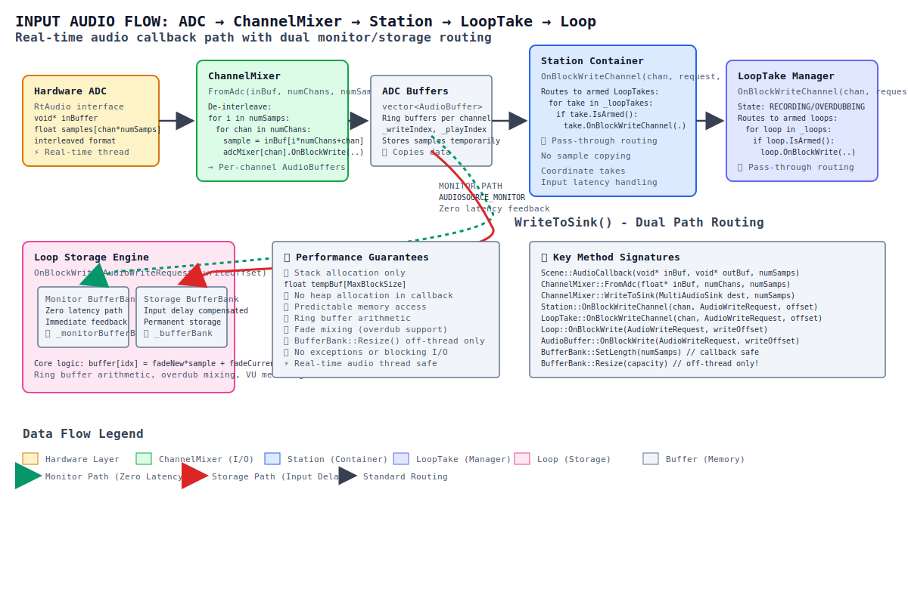
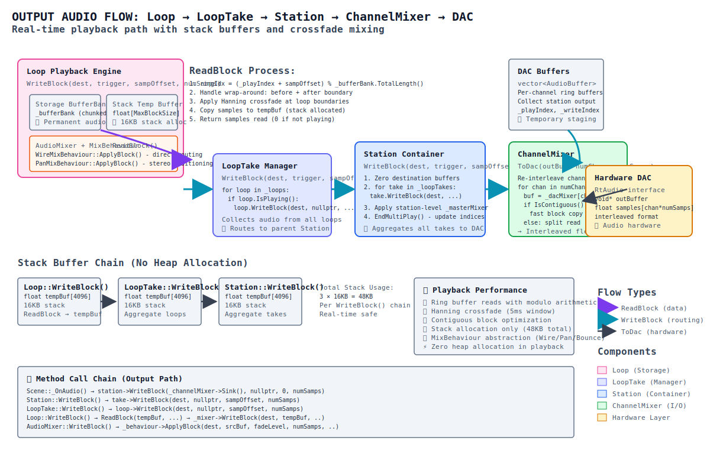

# Jamma Audio Flow Architecture

> **TL;DR**: ADC samples flow through ChannelMixer → Station → LoopTake → Loop (storage), then Loop → LoopTake → Station → ChannelMixer → DAC for playback. Real-time safe: stack buffers only, no heap allocation in audio callbacks.

## Overview

Jamma's audio engine is designed for **real-time loop recording and playback** with **zero-latency monitoring**. The architecture separates input recording from output playback while maintaining predictable, low-latency performance.

### Core Design Principles

- **Callback Safety**: No heap allocation, exceptions, or blocking I/O in audio threads
- **Separation of Concerns**: Clear boundaries between routing logic and audio storage
- **Hierarchical Model**: Station → LoopTake → Loop structure mirrors UI organization
- **Double Buffering**: Monitor path (zero latency) + storage path (with input delay compensation)

---

## Input Path: ADC → Storage

Audio flows from hardware input through multiple stages before being stored in loops:



```
┌─────────────┐    ┌──────────────┐    ┌─────────┐    ┌──────────┐    ┌──────┐
│   Hardware  │    │ ChannelMixer │    │ Station │    │ LoopTake │    │ Loop │
│     ADC     │───▶│   FromAdc()  │───▶│ OnBlock │───▶│ OnBlock  │───▶│ OnB  │
│             │    │              │    │ Write   │    │ Write    │    │ lock │
│ float* buf  │    │ Interleaved  │    │ Channel │    │ Channel  │    │ Writ │
│ (channels   │    │ → Per-Chan   │    │         │    │          │    │   e  │
│  mixed)     │    │ AudioBuffers │    │ (route) │    │ (route)  │    │(stor)│
└─────────────┘    └──────────────┘    └─────────┘    └──────────┘    └──────┘
```

### Phase 1: Hardware → ChannelMixer

**ChannelMixer::FromAdc(float\* inBuf, numChannels, numSamps)**

```cpp
// Extract interleaved hardware samples
for (unsigned int i = 0; i < numSamps; i++) {
    for (unsigned int chan = 0; chan < numChannels; chan++) {
        float sample = inBuf[i * numChannels + chan];
        // Route to per-channel AudioBuffer in AdcChannelMixer
    }
}
```

- **Input**: Interleaved float buffer from RtAudio hardware layer
- **Process**: De-interleave samples into separate AudioBuffer per input channel  
- **Buffer**: `AdcChannelMixer` stores samples in ring buffers
- **Output**: Per-channel audio streams ready for routing

### Phase 2: ADC Buffers → Station Routing

**ChannelMixer::WriteToSink(station, numSamps)** - Two-pass system:

#### Pass 1: Monitor (Zero Latency)
```cpp
// AUDIOSOURCE_MONITOR - immediate feedback
ChannelMixer → Station::OnBlockWriteChannel()
            → LoopTake::OnBlockWriteChannel() 
            → Loop::OnBlockWrite() 
            → writes to Loop::_monitorBufferBank
```

#### Pass 2: Recording (With Input Delay)
```cpp
// AUDIOSOURCE_ADC - compensates for audio interface latency  
ChannelMixer → Station::OnBlockWriteChannel()
            → LoopTake::OnBlockWriteChannel()
            → Loop::OnBlockWrite()
            → writes to Loop::_bufferBank (permanent storage)
```

### Phase 3: Loop Storage

**Loop::OnBlockWrite(AudioWriteRequest, writeOffset)**

```cpp
// Core storage logic with fade mixing
for each sample in request:
    idx = (_writeIndex + offset) % _bufferBank.TotalLength()
    _bufferBank[idx] = (fadeNew * sample) + (fadeCurrent * _bufferBank[idx])
```

- **Storage**: `BufferBank` (chunked vector, 1MB blocks)
- **Addressing**: Ring buffer with modulo arithmetic
- **Mixing**: Fade-based overdub support (`fadeCurrent * existing + fadeNew * incoming`)
- **Thread Safety**: SetLength() is callback-safe (clamps), Resize() must be off-thread

---

## Output Path: Storage → DAC

Playback flows from stored loops back to hardware output:



```
┌──────┐    ┌──────────┐    ┌─────────┐    ┌──────────────┐    ┌─────────────┐
│ Loop │    │ LoopTake │    │ Station │    │ ChannelMixer │    │   Hardware  │
│ Read │───▶│ Write    │───▶│ Write   │───▶│   ToDac()    │───▶│     DAC     │
│ Block│    │ Block    │    │ Block   │    │              │    │             │
│      │    │          │    │         │    │ Per-Chan →   │    │ float* buf  │
│(data)│    │ (route)  │    │ (route) │    │ Interleaved  │    │ (channels   │
│      │    │          │    │         │    │              │    │  mixed)     │
└──────┘    └──────────┘    └─────────┘    └──────────────┘    └─────────────┘
```

### Phase 1: Loop → Temporary Buffer

**Loop::WriteBlock(destination, trigger, sampOffset, numSamps)**

```cpp
// Step 1: Read from BufferBank with crossfade
float tempBuf[constants::MaxBlockSize];  // Stack allocated (16KB)
unsigned int samplesRead = ReadBlock(tempBuf, sampOffset, numSamps);

// Step 2: Route through AudioMixer  
if (trigger) {
    trigger->WriteBlock(destination, tempBuf, samplesRead);
} else {
    _mixer->WriteBlock(destination, tempBuf, samplesRead);
}
```

**Loop::ReadBlock()** handles:
- **Ring Buffer**: Reads from `_bufferBank` with wrap-around
- **Crossfade**: Hanning window for seamless loop boundaries  
- **Play State**: Returns 0 samples if not currently playing
- **Performance**: Stack buffer, no heap allocation

### Phase 2: AudioMixer → Destination Routing

**AudioMixer::WriteBlock(destination, srcBuffer, numSamps)**

```cpp
// Apply mix behavior (Wire, Pan, Bounce, Merge)
_behaviour->ApplyBlock(destination, srcBuffer, fadeLevel, numSamps, ...);
  └──> WireMixBehaviour::ApplyBlock()
       └──> destination->OnBlockWriteChannel(channel, request, 0)
```

Mix behaviors:
- **Wire**: Direct pass-through routing
- **Pan**: Stereo positioning with left/right coefficients  
- **Bounce**: Loop-to-loop overdub transfer
- **Merge**: Combine multiple sources

### Phase 3: Station → ChannelMixer → Hardware

**ChannelMixer::ToDac(float\* outBuf, numChannels, numSamps)**

```cpp
// Read from DacChannelMixer's AudioBuffers (station output)
for each output channel:
    buf = _dacMixer->Channel(chan)
    if (buf->IsContiguous(numSamps)) {
        // Fast path - direct memory access
        samples = buf->BlockRead(playIndex)
        for (i = 0; i < numSamps; i++) {
            outBuf[i * numChannels + chan] = samples[i];
        }
    } else {
        // Wrap-around case - split into two reads
    }
```

- **Input**: Per-channel AudioBuffers from Station processing
- **Process**: Re-interleave separate channels into hardware format
- **Output**: Interleaved float buffer for RtAudio hardware layer
- **Optimization**: Contiguous reads when possible, split reads for ring buffer wrap

---

## Buffer Management Strategy


| Component | Storage Type | Copies Data? | Thread Safety |
|-----------|--------------|---------------|---------------|
| **ChannelMixer ADC/DAC** | `vector<AudioBuffer>` | ✅ Yes | Callback safe |
| **Station** | `vector<AudioBuffer>` | ❌ Routes only | Double-buffered |
| **LoopTake** | `vector<AudioBuffer>` | ❌ Routes only | Double-buffered |
| **Loop** | `BufferBank` (chunked) | ✅ Yes | SetLength() safe, Resize() off-thread |
| **AudioBuffer** | `vector<float>` | ✅ Yes | Callback safe |

### Pass-Through vs Storage Classes

**Pass-Through Classes** (Station, LoopTake):
- **Purpose**: Route audio between layers of hierarchy
- **OnBlockWriteChannel()**: Delegate to child objects (takes → loops)
- **WriteBlock()**: Chain calls upward, collecting audio from children
- **Memory**: No sample copying, just coordination

**Storage Classes** (Loop, AudioBuffer):
- **Purpose**: Actually store and retrieve audio samples
- **OnBlockWrite()**: Copy samples with ring-buffer arithmetic and fade mixing
- **ReadBlock()**: Retrieve samples with crossfade and loop boundary handling
- **Memory**: Ring buffers with wrap-around logic

### Stack Allocation Strategy

All audio processing uses **stack-allocated buffers** in the real-time path:

```cpp
// Each WriteBlock() allocates on stack
float tempBuf[constants::MaxBlockSize];  // 4096 samples = 16KB

// Chain calls: Station → LoopTake → Loop
// Total stack usage ≈ 48KB (3 × 16KB)
// NO heap allocation during audio callbacks
```

---

## GUI Routing Control: GuiRack Integration


### Overview

GuiRack serves as the **central UI control point** for audio mixing and routing in both Station and LoopTake classes. It provides a visual interface for managing channel levels, routing matrices, and output bus assignments that directly control the audio flow during playback.

### GuiRack Architecture

**Location**: `JammaLib/src/gui/GuiRack.h` and `GuiRack.cpp`

GuiRack operates in three distinct states:
- **RACK_MASTER**: Master volume control only
- **RACK_CHANNELS**: Master + individual channel level controls  
- **RACK_ROUTER**: Master + channels + visual routing matrix

```cpp
class GuiRack {
    std::shared_ptr<GuiSlider> _masterSlider;        // Overall level (0.0-6.0)
    std::vector<std::shared_ptr<GuiSlider>> _channelSliders;  // Per-channel levels
    std::shared_ptr<GuiRouter> _router;              // Visual routing matrix
    
    // Key methods:
    void SetNumInputChannels(unsigned int chans);    // Input channel count
    void SetNumOutputChannels(unsigned int chans);   // Output bus count  
    void AddRoute(unsigned int inputChan, unsigned int outputChan);
    void ClearRoutes();
};
```

### Station Integration

**Member Variable**: `std::shared_ptr<gui::GuiRack> _guiRack` (Station.h:133)

#### Channel Architecture Control

```cpp
void Station::SetNumBusChannels(unsigned int chans) {
    _backAudioBuffers.clear();
    _backAudioMixers.clear();
    _guiRack->ClearRoutes();
    _guiRack->SetNumInputChannels(chans);  // GUI determines buffer count
    
    for (unsigned int i = 0; i < chans; i++) {
        // Create AudioBuffer per GUI input channel
        _backAudioBuffers.push_back(std::make_shared<audio::AudioBuffer>(_lastBufSize));
        
        // Create AudioMixer with routing to match GUI
        MergeMixBehaviourParams mergeParams;
        if (i < _guiRack->NumOutputChannels())
            mergeParams.Channels.push_back(i);  // Wire input i → output i
        
        auto mixer = std::make_shared<audio::AudioMixer>(mixerParams);
        _backAudioMixers.push_back(mixer);
        
        // Sync GUI route with audio mixer
        if (i < _guiRack->NumOutputChannels())
            _guiRack->AddRoute(i, i);
    }
}
```

#### Routing Update Flow

When user modifies routing in GuiRack:

```cpp
// Station receives GuiAction::ACTIONELEMENT_RACK
case GuiAction::ACTIONELEMENT_RACK:
    if (auto chans = std::get_if<GuiAction::GuiConnections>(&action.Data)) {
        // Extract routing connections for each input channel
        for (auto chan = 0u; chan < _audioMixers.size(); chan++) {
            std::vector<unsigned int> outputChannels = ExtractOutputsForInput(chan, chans);
            
            // Update mixer behavior to route to selected outputs
            _audioMixers[chan]->SetChannels(outputChannels);
        }
    }
```

### LoopTake Integration

**Member Variable**: `std::shared_ptr<gui::GuiRack> _guiRack` (LoopTake.h:168)

#### Loop Addition and Routing

```cpp
void LoopTake::AddLoop(std::shared_ptr<Loop> loop) {
    _backLoops.push_back(loop);
    _backAudioBuffers.push_back(std::make_shared<audio::AudioBuffer>(_lastBufSize));
    
    // Create mixer with default routing
    WireMixBehaviourParams wireParams;
    if (_backAudioBuffers.size() <= NumBusChannels())
        wireParams.Channels.push_back((unsigned int)(_backAudioBuffers.size() - 1));
    
    auto mixer = std::make_shared<audio::AudioMixer>(mixerParams);
    _backAudioMixers.push_back(mixer);
    
    // Update GUI to reflect new input channel
    _guiRack->SetNumInputChannels((unsigned int)_backLoops.size());
    _guiRack->AddRoute((unsigned int)_backLoops.size() - 1, 
                       (unsigned int)_backLoops.size() - 1);
}
```

#### Bus Channel Query

```cpp
unsigned int LoopTake::NumBusChannels() const {
    if (nullptr != _guiRack)
        return _guiRack->NumOutputChannels();  // GUI controls max output channels
    return 0u;
}
```

### Audio Routing Impact

#### Three-Level Control Hierarchy

1. **Master Volume** (GuiSlider index 0)
   - Applied to entire bus output via `_masterMixer`
   - Affects all channels equally
   - Controls overall Station/LoopTake level

2. **Per-Channel Levels** (GuiSlider indices 1+)
   - Individual level control for each input channel
   - One slider per Loop in LoopTake
   - Calls `loop->SetMixerLevel(value)` on change

3. **Routing Matrix** (GuiRouter)
   - Visual mapping: input channels → output buses
   - User draws connections in GUI
   - Triggers `GuiAction::GuiConnections` with routing pairs
   - Updates `AudioMixer::SetChannels()` for each input

#### WriteBlock Integration

The routing flows through the audio pipeline:

```cpp
// In Station::WriteBlock() and LoopTake::WriteBlock()
void WriteBlock(dest, trigger, indexOffset, numSamps) {
    // Process children to bus channels
    for (const auto& child : children)
        child->WriteBlock(this, trigger, indexOffset, numSamps);
    
    // Apply GuiRack routing via mixers
    for (size_t i = 0; i < _audioBuffers.size(); i++) {
        auto buf = _audioBuffers[i];
        auto mixer = _audioMixers[i];
        
        // mixer applies routing from GuiRack via SetChannels()
        mixer->WriteBlock(dest, buf->BlockRead(playIndex), numSamps);
            └─> MixBehaviour::ApplyBlock(dest, srcBuf, fadeLevel, numSamps)
                └─> for (chan : _mixParams.Channels)  // GuiRack routes
                    └─> dest->OnBlockWriteChannel(chan, request, startIndex);
    }
}
```

### Routing Data Flow

```
User Action in GuiRack
         ↓
GuiRouter::OnAction() 
         ↓
GuiAction::ACTIONELEMENT_ROUTER + GuiConnections
         ↓
Station/LoopTake::OnAction()
         ↓
Extract routing pairs: {input → output}
         ↓
AudioMixer::SetChannels(outputChannels)
         ↓
MixBehaviour updates _mixParams.Channels
         ↓
Next WriteBlock() uses new routes
         ↓
Audio emerges on different physical outputs
```

### Performance Considerations

- **Real-Time Safe**: GuiRack updates happen on UI thread, audio changes applied via atomic pointer swaps
- **Buffer Swapping**: Station/LoopTake use `_backAudioBuffers` ↔ `_audioBuffers` pattern for thread-safe updates
- **Routing Efficiency**: MixBehaviour only writes to channels specified in `_mixParams.Channels`
- **Memory Impact**: GuiRack routing doesn't affect audio buffer allocation, only output destination

### Integration Summary

| Component | Role in Routing | Audio Impact |
|-----------|----------------|--------------|
| **GuiRack** | UI control surface | Defines input/output channel counts and routing topology |
| **GuiRouter** | Visual routing matrix | User-drawn connections become routing data |
| **GuiSlider** | Level controls | Master and per-channel volume adjustments |
| **AudioMixer** | Routing application | Applies GuiRack routes via WireMixBehaviour/MergeMixBehaviour |
| **MixBehaviour** | Output logic | Routes samples to OnBlockWriteChannel based on GUI routing |

GuiRack transforms user interface interactions into **precise audio routing control**, enabling complex mixing scenarios while maintaining real-time performance through the existing WriteBlock() pipeline.

---

## Key Classes Deep Dive

### Scene (`src/engine/Scene.cpp`)

**Real-time audio callback coordinator**

```cpp
int Scene::AudioCallback(void* outBuffer, void* inBuffer, unsigned int numSamps, 
                        double streamTime, RtAudioStreamStatus status, void* userData) {
    Scene* scene = static_cast<Scene*>(userData);
    float* inBuf = static_cast<float*>(inBuffer);
    float* outBuf = static_cast<float*>(outBuffer);
    
    scene->_OnAudio(inBuf, outBuf, numSamps);
    return 0;
}
```

**Scene::_OnAudio()** coordinates the full pipeline:
1. **Input Recording** (lines 652-686): `FromAdc()` → `WriteToSink()` → `OnBounce()`
2. **Output Preparation** (lines 690-696): Zero buffers for clean mix
3. **Loop Playback** (lines 698-710): `station->WriteBlock()` chains
4. **Hardware Output** (lines 712-716): `ToDac()` to hardware

### ChannelMixer (`src/audio/ChannelMixer.h`)

**Hardware interface abstraction**

```cpp
class ChannelMixer {
    std::shared_ptr<base::MultiAudioSource> _adcMixer;  // Input buffers
    std::shared_ptr<base::MultiAudioSink> _dacMixer;    // Output buffers
    
public:
    void FromAdc(float* inBuf, unsigned int numChannels, unsigned int numSamps);
    void WriteToSink(const std::shared_ptr<base::MultiAudioSink> dest, unsigned int numSamps);
    void ToDac(float* outBuf, unsigned int numChannels, unsigned int numSamps);
};
```

### Station (`src/engine/Station.h`)

**Top-level loop container**

- **State**: Collection of LoopTakes + master mixer
- **Input**: `OnBlockWriteChannel()` routes incoming audio to armed takes
- **Output**: `WriteBlock()` collects audio from all takes for playback
- **Coordination**: Manages recording state, input latency, bounce operations

### LoopTake (`src/engine/LoopTake.h`)

**Recording take manager**

- **State Machine**: INACTIVE → RECORDING → PLAYING → OVERDUBBING → etc.
- **Input**: Routes to armed loops based on current state
- **Output**: Mixes output from constituent loops
- **Source Types**: Can record from ADC, Station, or other LoopTakes (bouncing)

### Loop (`src/engine/Loop.h`)

**Core audio storage and playback**

```cpp
class Loop {
    audio::BufferBank _bufferBank;          // Permanent storage
    audio::BufferBank _monitorBufferBank;   // Zero-latency monitor
    unsigned int _writeIndex, _playIndex;   // Ring buffer positions
    unsigned int _loopLength;               // Loop duration in samples
    
public:
    unsigned int ReadBlock(float* outBuf, int sampOffset, unsigned int numSamps);
    void WriteBlock(const std::shared_ptr<base::MultiAudioSink> dest, ...);
    void OnBlockWrite(const base::AudioWriteRequest& request, int writeOffset);
};
```

**Key Features**:
- **Dual BufferBanks**: Monitor (immediate) + storage (delayed) paths
- **Crossfading**: Hanning window for seamless loop boundaries
- **VU Metering**: Peak level tracking during recording
- **Overdub Mixing**: Fade-based sample combination

---

## Performance Characteristics

### Real-Time Safety Guarantees

✅ **Audio Callback Safe Operations**:
- Stack allocation (`float tempBuf[MaxBlockSize]`)
- Ring buffer arithmetic with modulo
- BufferBank::SetLength() (clamps to existing capacity)
- Sample copying with fade mixing
- Index updates and state changes

❌ **Off-Thread Only Operations**:
- BufferBank::Resize() (heap allocation for capacity growth)
- BufferBank::UpdateCapacity() (grows buffer banks)
- Vector reallocations in AudioBuffer setup
- Exception handling or blocking I/O

### Latency Characteristics

- **Monitor Path**: Zero additional latency (immediate ADC → monitor buffer → DAC)
- **Recording Path**: Input latency compensation via `InitPlay(delaySamps)`
- **Playback Path**: Fixed block size processing (typically 256-1024 samples)
- **Crossfade**: 5ms Hanning window at loop boundaries

### Memory Usage

- **Per Loop**: 2× BufferBank (monitor + storage) ≈ 2MB per minute of audio
- **Per Station**: AudioBuffers for channel mixing ≈ 64KB
- **Stack Usage**: ≈48KB during nested WriteBlock() calls
- **Total**: Scales with number of active loops and recording duration

---

## Integration Points

### RtAudio Interface

Scene::AudioCallback() provides the bridge to RtAudio:
- **Input**: `void* inBuffer` (interleaved float from ADC)
- **Output**: `void* outBuffer` (interleaved float to DAC)  
- **Threading**: Runs on dedicated real-time audio thread
- **Timing**: Fixed block size, called at regular intervals (e.g., every 5-23ms)

### UI Integration 

The audio engine exposes control interfaces:
- **Station/LoopTake/Loop**: State management (Record, Play, Overdub)
- **VU Meters**: Peak level monitoring via Loop::_vu
- **Transport**: Global play/pause coordination
- **Input Monitoring**: Zero-latency feedback through monitor path

---

## Summary

Jamma's audio architecture achieves **professional loop recording performance** through:

1. **Clean Separation**: Input recording vs output playback paths
2. **Hierarchical Routing**: Station → LoopTake → Loop mirrors user mental model  
3. **Real-Time Safety**: Stack allocation, predictable memory access patterns
4. **Zero-Latency Monitoring**: Dual buffer system (monitor + storage)
5. **Seamless Looping**: Crossfade windows and ring buffer arithmetic

The result is a **robust, low-latency loop sampler** suitable for live performance and studio recording, with architectural clarity that supports ongoing development and debugging.