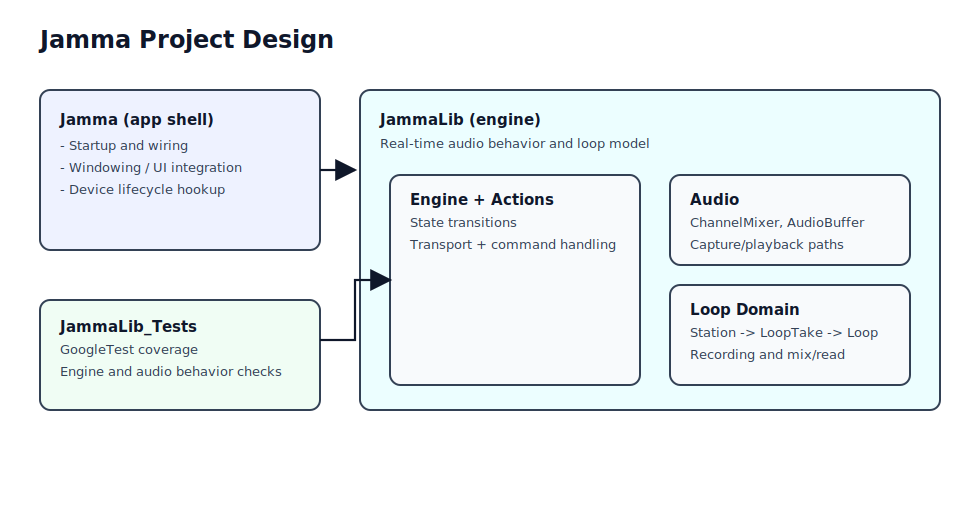
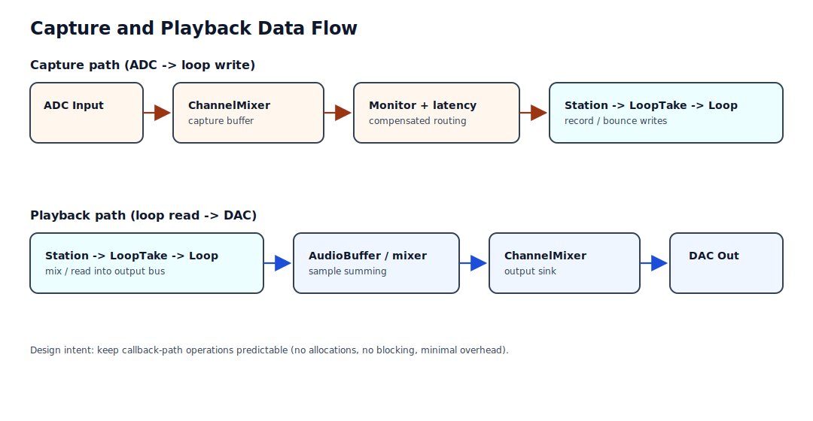

# Jamma Documentation


## Build Instructions

* Prerequisites:
 - Windows
 - Visual Studio 2026 (C++ desktop workload), or VS Code with the C/C++ extension and Visual Studio 2026 Build Tools installed
 - Windows SDK 10.0

* Configuration:
 - Toolset: v145
 - Language standard: stdcpplatest
 - Platform: x64

* Building:

  1. Locate MSBuild using vswhere
```bat
for /f "usebackq tokens=*" %%i in (
  `"%ProgramFiles(x86)%\Microsoft Visual Studio\Installer\vswhere.exe" -latest -requires Microsoft.Component.MSBuild -find MSBuild\**\Bin\MSBuild.exe`
) do set MSBUILD=%%i
```

2. Build solution

```bat
"%MSBUILD%" Jamma.sln /m /t:Build /p:Configuration=Debug /p:Platform=x64
"%MSBUILD%" Jamma.sln /m /t:Build /p:Configuration=Release /p:Platform=x64
```

If you have visual studio installed, then through PowerShell:

```powershell
$msbuild = Join-Path $env:VSINSTALLDIR "MSBuild\Current\Bin\MSBuild.exe"
& $msbuild JammaLib\JammaLib.vcxproj /m /t:Build /p:Configuration=Debug /p:Platform=x64
& $msbuild Jamma\Jamma.vcxproj /m /t:Build /p:Configuration=Debug /p:Platform=x64
& $msbuild test\JammaLib.Tests\JammaLib.Tests.vcxproj /m /t:Build /p:Configuration=Debug /p:Platform=x64
```

Solution build (sparingly):

```powershell
$msbuild = Join-Path $env:VSINSTALLDIR "MSBuild\Current\Bin\MSBuild.exe"
& $msbuild Jamma.sln /m /t:Build /p:Configuration=Debug /p:Platform=x64
& $msbuild Jamma.sln /m /t:Build /p:Configuration=Release /p:Platform=x64
```


## Project Structure

- `Jamma`: application shell, startup, and top-level wiring.
- `JammaLib`: engine, loop model, audio behavior, rendering/audio support layers.
- `test/JammaLib.Tests`: native GoogleTest coverage for engine/audio behavior.

## Core Domain Model

The looping model is hierarchical:

- `Station`: top-level loop station state and coordination.
- `LoopTake`: a take/layer grouping within a station.
- `Loop`: underlying sample data and playback/record behavior.

This structure helps isolate responsibilities while keeping composition simple.

## High-Level Architecture



Notes:

- The app project (`Jamma`) should stay thin and delegate engine behavior to `JammaLib`.
- Tests target `JammaLib` behavior directly for fast feedback and minimal UI coupling.

## Audio Signal Flow



Capture path:

1. ADC input enters the mixer capture buffer.
2. Monitor and latency-compensated routing are applied.
3. Samples are written into `Station -> LoopTake -> Loop`.

Playback path:

1. Loop model reads/mixes content for output.
2. Audio data is accumulated through buffer/mixer stages.
3. Channel mixer sends final output to DAC.
